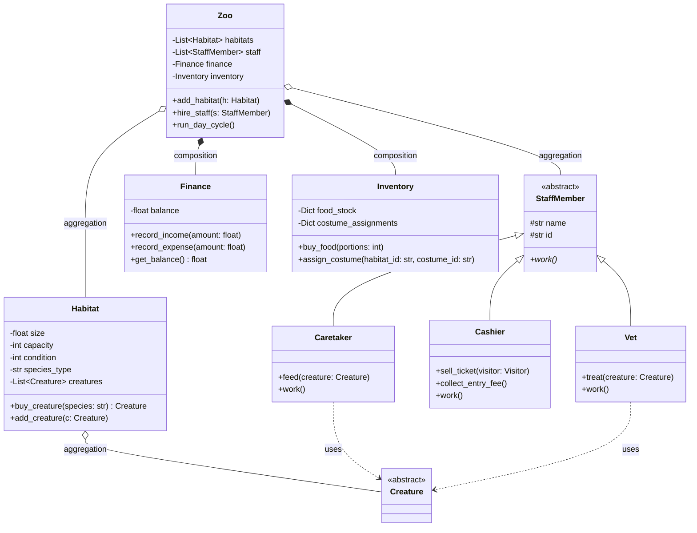
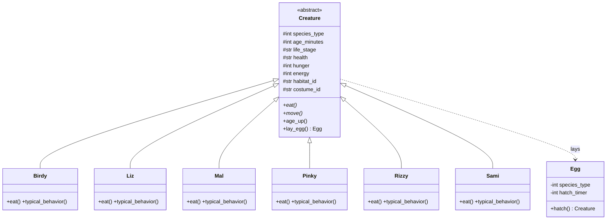
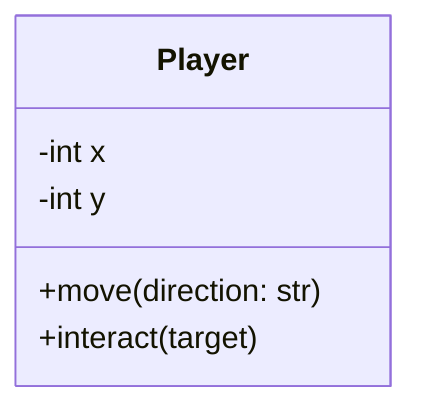
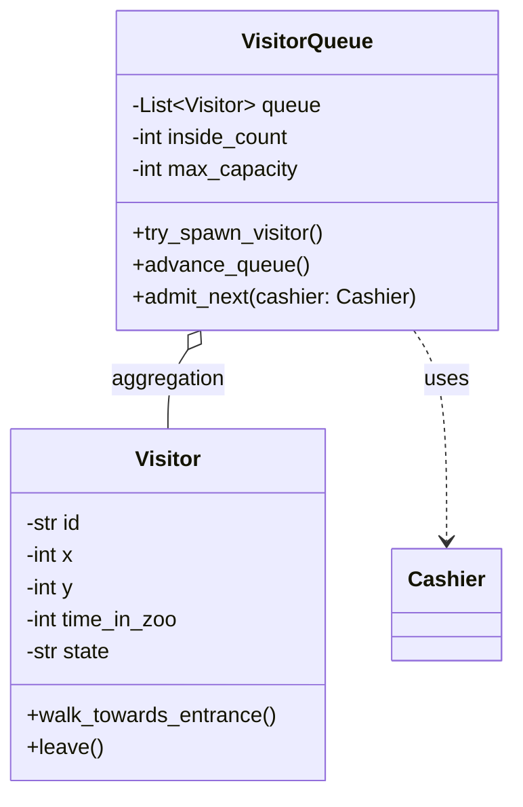
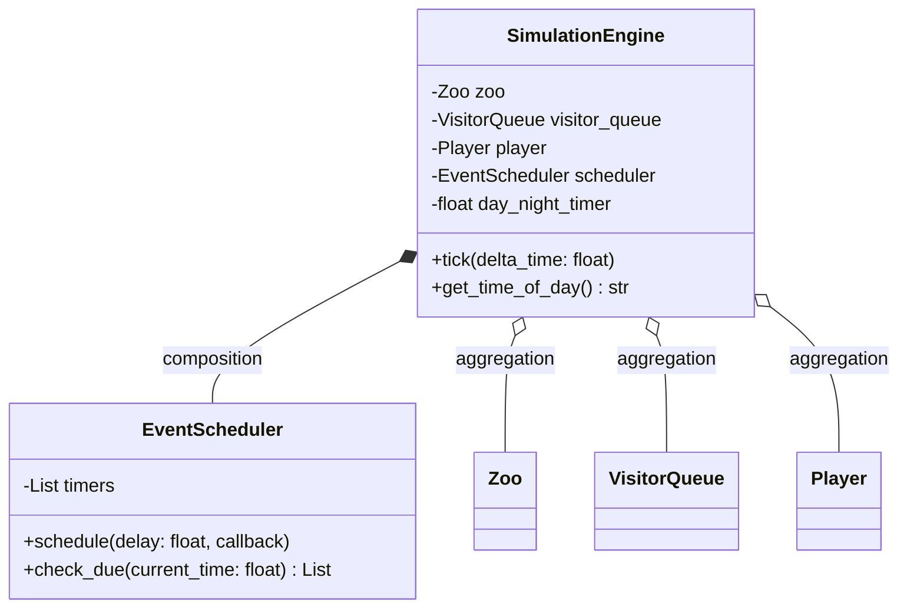
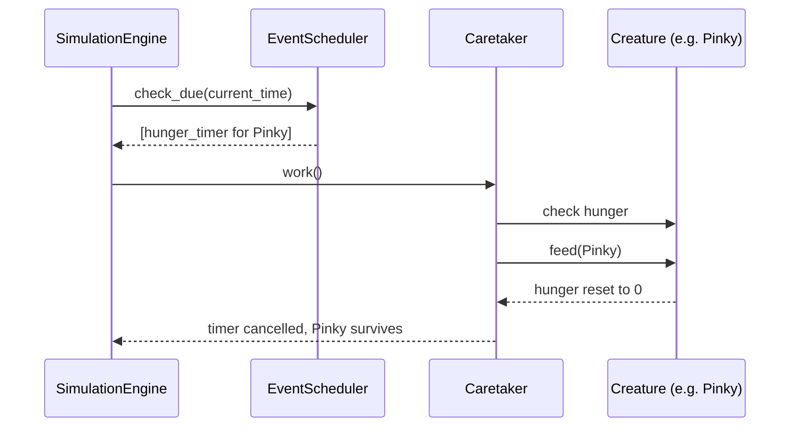
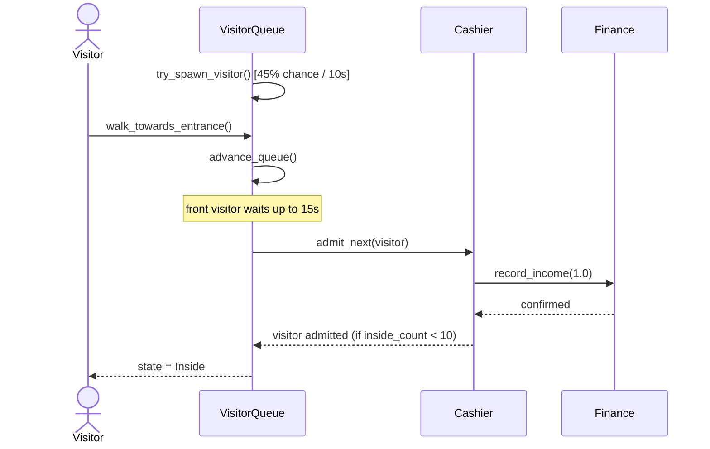
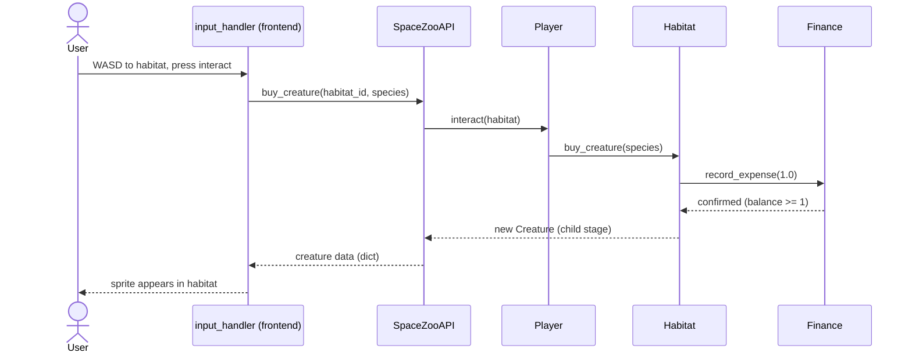
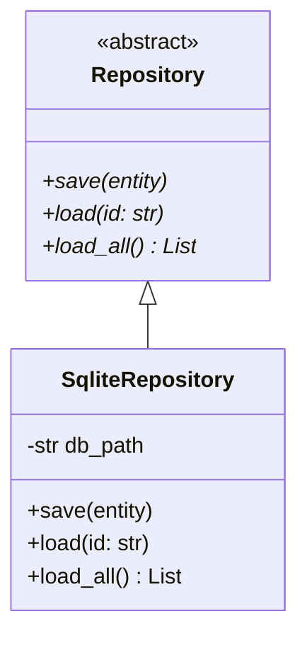
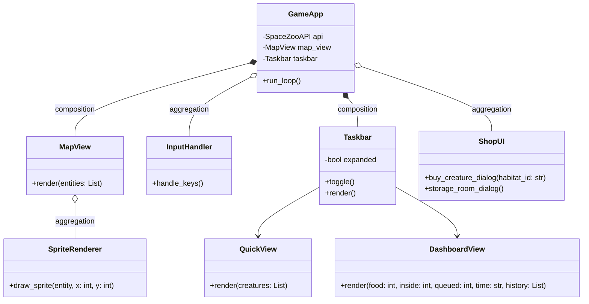

# SpaceZoo — Project Plan

**Team**: Jasmin (backend) · Mo (frontend & UI, Pygame)
**Primary source**: original assignment ("Digitaler Zwilling einer Zoo-Simulation") — defines the mandatory OOP structure, the four-layer separation, class/sequence diagrams, and grading criteria.
**Secondary source**: the detailed game-design prompt (map size, sprite size, life-cycle timers, economy, visitor queue, day/night cycle, taskbar UI) — defines the concrete game mechanics that fill in the assignment's abstract skeleton.
**Entity names**: taken from the actual project file tree — `Ben` (player), `Birdy`, `Liz`, `Mal`, `Pinky`, `Rizzy`, `Sami` (the six creature species), `Visitor`.

---

## 1. Team Split & Individual Contribution

- **Jasmin — Backend**: facility management, creature simulation, life-cycle/hunger/disease system, simulation core, database/persistence.
- **Mo — Frontend & UI**: Pygame rendering, map, taskbar, input handling (Ben's movement), interface facade (jointly defined with Jasmin).

`README.md` records this explicitly:

```markdown
## Responsibilities
- Backend, database, simulation logic: Jasmin
- Frontend, rendering, UI, interface facade: Mo
```

Every module carries an `Author:` line in its docstring header.

---

## 2. Architecture & Folder Structure

The assignment requires a **visibly separated** four-layer architecture (backend / database / interface / frontend) with a strict **one class = one file** rule. The game prompt's five-step build order is mapped onto this structure below.

```
spacezoo/
├── backend/                          # [Jasmin]
│   ├── facility/
│   │   ├── zoo.py                     # central composition class
│   │   ├── staff_member.py            # abstract base class
│   │   ├── caretaker.py               # feeds, heals hungry/sick creatures (AI-controlled)
│   │   ├── vet.py                     # dedicated disease treatment
│   │   ├── cashier.py                 # handles ticket sales, entry fees
│   │   ├── habitat.py                 # enclosure, holds creatures
│   │   ├── finance.py                 # starting capital, income/expenses
│   │   └── inventory.py               # food stock, costumes
│   ├── creatures/
│   │   ├── creature.py                # abstract base class (shared life-cycle/hunger/disease logic)
│   │   ├── birdy.py
│   │   ├── liz.py
│   │   ├── mal.py
│   │   ├── pinky.py
│   │   ├── rizzy.py
│   │   ├── sami.py
│   │   ├── life_stage.py              # enum: CHILD, ADULT, OLD
│   │   └── egg.py                     # laid by creatures, hatches into new creature
│   ├── player/
│   │   └── player.py                  # Ben — user-controlled entity, not simulated like a Creature
│   ├── visitors/
│   │   ├── visitor.py                 # a single visitor (cat)
│   │   └── visitor_queue.py           # queueing/capacity logic
│   └── simulation/
│       ├── simulation_engine.py       # tick(), day/night cycle
│       └── event_scheduler.py         # hunger timers, disease timers, spawn timers
├── database/                          # [Jasmin]
│   ├── repository.py                  # abstract interface
│   ├── sqlite_repository.py           # concrete implementation
│   └── models.py                      # object <-> row mapping
├── interface/                         # [joint contract]
│   └── spacezoo_api.py                # facade — the only entry point the frontend may use
├── frontend/                          # [Mo]
│   ├── app.py                         # Pygame entry point, game loop
│   ├── map_view.py                    # fixed 1260x960 canvas, no scrolling
│   ├── sprite_renderer.py             # renders all 60x60 sprites
│   ├── input_handler.py               # WASD / arrow keys for Ben
│   ├── taskbar/
│   │   ├── taskbar.py                 # collapsible/expandable container
│   │   ├── quick_view.py              # collapsed state
│   │   └── dashboard_view.py          # expanded state
│   └── shop_ui.py                     # habitat purchase + storage room UI
├── tests/
│   ├── test_creatures.md
│   ├── test_facility.md
│   ├── test_visitors.md
│   ├── test_simulation.md
│   └── test_frontend.md
├── docs/
│   ├── diagrams/                      # all .mmd files
│   └── README.md
└── main.py
```

**Rule**: `frontend/` imports only from `interface/spacezoo_api.py`, never directly from `backend.*` or `database.*`. This is the visible separation the assignment explicitly requires.

---

## 3. Map & Rendering Constants

| Constant | Value |
|---|---|
| Map size | 1260 × 960 px, fixed, no camera scrolling |
| Sprite size | 60 × 60 px for all characters, creatures, and visitors |
| Grid | 21 columns × 16 rows (1260/60, 960/60) |
| Starting capital | $5 |

These live in a single `frontend/map_view.py` constants block and a mirrored `backend` constant module, so both layers agree on grid coordinates without importing each other's internals.

---

## 4. Facility Management Layer [Jasmin]

- **`Zoo`**: central class, aggregates `Habitat[]` and `StaffMember[]`, composes `Finance` (1:1) and `Inventory` (1:1). Methods: `add_habitat()`, `hire_staff(cost=10)`, `run_day_cycle()`.
- **`StaffMember`** (abstract base class): `_name`, `_id` encapsulated via property, abstract method `work()`. Hiring cost is fixed at $10 per the game spec, enforced in `Zoo.hire_staff()`.
- **`Caretaker(StaffMember)`**: `feed(creature)`, autonomously moves to and feeds hungry creatures — implements the "AI-controlled staff" requirement from the game prompt.
- **`Vet(StaffMember)`**: `treat(creature)`, autonomously moves to and heals sick creatures before their 15-second death timer expires.
- **`Cashier(StaffMember)`**: `sell_ticket(visitor)`, `collect_entry_fee()` — handles the $1 entry payment at the queue front.
- **`Habitat`**: `_size`, `_capacity`, `_condition` (0–100, validated property), `_species_type` (which of the 6 species it's built for), list `_creatures` (aggregation). Purchasing a young creature happens *at* a habitat (`buy_creature(species) -> $1`).
- **`Finance`**: `_balance` (private, starts at $5), `record_income(amount)`, `record_expense(amount)`, `get_balance()` — no direct external mutation.
- **`Inventory`**: `Dict[str, int]` for food portions (bought at $0.25 each) and `Dict[str, str]` for costume assignments per habitat.

### 4.1 Class Diagram



---

## 5. Creature Layer [Jasmin]

- **`Creature`** (abstract base class): `_species_type` (1–6), `_age_minutes`, `_life_stage`, `_health` (Healthy/Sick), `_hunger` (0–100%), `_energy` (0–100%), `_habitat_id`, `_costume_id`. All numeric attributes validated via properties. Abstract methods `eat()`, `move()`. Shared concrete logic: `age_up()`, `lay_egg()`.

### 5.1 Life Cycle (15 minutes total)

| Phase | Range | Behavior |
|---|---|---|
| Child | 0–5 min | cannot lay eggs, purchasable at habitat for $1 |
| Adult | 5–10 min | can lay eggs randomly |
| Old | 10–15 min | reduced activity |
| Death | > 15 min | dies of old age |

### 5.2 Hunger & Disease Timers

- **Hunger**: rises continuously via `event_scheduler`. At 100%, a 10-second death timer starts (`EventScheduler.schedule(10s, kill_if_not_fed)`). A `Caretaker.feed()` call before expiry resets hunger and cancels the timer.
- **Disease**: random onset per tick (probability configurable). Triggers a 15-second death timer. A `Vet.treat()` call before expiry cures the creature.

### 5.3 The Six Species

Each overrides `eat()` (diet/animation) and `typical_behavior()` (movement pattern); shared life-cycle/hunger/disease logic stays in `Creature`.

- **`Birdy(Creature)`**
- **`Liz(Creature)`**
- **`Mal(Creature)`**
- **`Pinky(Creature)`**
- **`Rizzy(Creature)`**
- **`Sami(Creature)`**

- **`Egg`**: laid by an adult creature in its habitat, holds `_species_type` and `_hatch_timer`; on hatching, instantiates the matching `Creature` subclass (child stage).

### 5.4 Class Diagram



---

## 6. Player — Ben [Jasmin backend state / Mo input handling]

- **`Player`**: not a `Creature` (no life-cycle/hunger/disease), not a `StaffMember`. A distinct, user-controlled entity.
  - Attributes: `_x`, `_y` (grid position, bounded to 1260×960), `_balance_ref` (reference to `Finance`).
  - Methods: `move(direction)` (called from `frontend/input_handler.py` on WASD/arrow input), `interact(target)` (buy creature at habitat, buy food/costume at storage room).



---

## 7. Visitors [Jasmin]

- **`Visitor`**: `_id`, `_x`, `_y`, `_time_in_zoo` (max 40s, then despawns), `_state` (Queueing/Inside/Leaving).
- **`VisitorQueue`**: manages spawning and queueing logic.
  - Spawn: every 10 seconds, 45% chance a new `Visitor` spawns top-left.
  - Visitors walk toward the entrance and line up single-file behind the queue front.
  - Front-of-queue visitor waits up to 15 seconds, then pays $1 entry (via `Cashier`) and enters if capacity allows.
  - Max capacity inside zoo: 10 simultaneously. Queue halts entirely when full, resumes when a visitor leaves (after 40s).

### 7.1 Class Diagram



---

## 8. Simulation Core [Jasmin]

- **`SimulationEngine`**: holds references to `Zoo`, `VisitorQueue`, `Player`, and `EventScheduler`. `tick()` runs every frame/interval and:
  1. Ages all creatures, advances life stage, kills any past 15 minutes.
  2. Increments hunger for all creatures; triggers 10s death timers at 100%.
  3. Rolls disease probability; triggers 15s death timers on new sickness.
  4. Runs `Caretaker`/`Vet` AI passes (auto-feed/auto-heal).
  5. Advances the day/night cycle (2-minute full cycle).
  6. Delegates to `VisitorQueue` for spawning/queue advancement.
- **`EventScheduler`**: generic timer registry for hunger-death, disease-death, egg-hatch, and visitor-despawn timers — all expressed as `(deadline, callback)` pairs, checked each tick.

### 8.1 Class Diagram



### 8.2 Sequence Diagram — "Hunger timer expires, Caretaker saves the creature"



### 8.3 Sequence Diagram — "Visitor entry through the queue"



### 8.4 Sequence Diagram — "Ben buys a young creature"



---

## 9. Database / Persistence Layer [Jasmin]

- **`repository.py`**: abstract interface — `save(entity)`, `load(id)`, `load_all()`.
- **`sqlite_repository.py`**: concrete SQLite implementation. Tables: `creatures`, `habitats`, `staff`, `visitors`, `finance_log`.
- **`models.py`**: row ↔ object mapping so backend domain classes never touch SQL directly.



Persisted each tick or on a fixed interval: creature states, inventory levels, finance balance, and a status-history log per habitat (feeds the taskbar's disease-history view).

---

## 10. Frontend & UI — Pygame [Mo]

### 10.1 Rendering

- `map_view.py`: draws the fixed 1260×960 canvas, no scrolling, tile grid at 60px.
- `sprite_renderer.py`: renders all entities (Ben, the six species, staff, visitors) at exactly 60×60 px.
- `input_handler.py`: WASD/arrow keys move Ben; an interact key triggers `Player.interact()` via the API when Ben is adjacent to a habitat or the storage room.

### 10.2 Taskbar (collapsible, bottom of screen)

| State | Content |
|---|---|
| **Collapsed** (quick view) | Per creature: species, hunger %, age, energy % |
| **Expanded** (dashboard) | Food stock in inventory · visitors inside vs. in queue · current in-game date & day/night phase · disease/status history per habitat |

### 10.3 Shop UI

- **Habitat interaction**: buy a child-stage creature of the habitat's species for $1.
- **Storage room**: buy food ($0.25/portion), assign costumes to creatures in a given habitat.

### 10.4 Class Diagram



### 10.5 Interface Contract

`interface/spacezoo_api.py` is the single boundary object. Signatures fixed contract-first so Mo can build against a mock while Jasmin builds the backend:

```python
class SpaceZooAPI:
    def get_zoo_state(self) -> dict: ...
    def get_creatures(self) -> list[dict]: ...
    def buy_creature(self, habitat_id: str, species: str) -> dict: ...
    def feed_creature(self, creature_id: str) -> dict: ...
    def buy_food(self, portions: int) -> dict: ...
    def assign_costume(self, habitat_id: str, costume_id: str) -> dict: ...
    def hire_staff(self, staff_type: str) -> dict: ...
    def get_visitor_stats(self) -> dict: ...
    def get_time_of_day(self) -> dict: ...
    def move_player(self, direction: str) -> dict: ...
    def tick(self, delta_time: float) -> dict: ...
```

All return values are plain `dict`/`list[dict]`, never raw backend objects — this keeps `frontend/` fully decoupled from `backend/` internals.

---

## 11. Implementation Plan

Mapped from the game prompt's 5-step build order onto the assignment's phased/parallel approach.

**Phase 0 — Setup & Contract (joint, 1 day)**
Folder structure, git repo, README with responsibilities, fix `SpaceZooAPI` signatures (Section 10.5).

**Phase 1 — Step 1: Database schema & repositories (Jasmin, 2 days)**
`repository.py`, `sqlite_repository.py`, `models.py` for creatures, inventory, visitor statistics.

**Phase 2 — Step 2: Core classes (Jasmin, 3–4 days, parallel with Mo's rendering scaffold)**
`Creature` + six species, `Player`, `Visitor`, `StaffMember` hierarchy, `Habitat`, map-geometry constants (1260×960 grid). Mo starts `map_view.py` and `sprite_renderer.py` against mock data.

**Phase 3 — Step 3: Visitor queueing logic (Jasmin, 2 days)**
`VisitorQueue`: spawn probability, entrance waiting, single-file queueing, $1 entry, 10-visitor cap.

**Phase 4 — Step 4: Life-cycle, hunger, disease timers (Jasmin, 3 days)**
`EventScheduler` timers, `SimulationEngine.tick()` integration, `Caretaker`/`Vet` AI passes.

**Phase 5 — Step 5: UI taskbar & rendering (Mo, 3–4 days, in parallel with Phase 3–4 once contract is stable)**
`Taskbar` (collapsed/expanded), `ShopUI`, `InputHandler`, final Pygame game loop wiring against the real `SpaceZooAPI`.

**Phase 6 — Integration (joint, 2–3 days)**
Replace mocks with the real API, end-to-end test of the sequence diagrams in Section 8.2–8.4, bugfixing.

**Phase 7 — Documentation, tests, reflection (joint, 2 days, contributions marked separately)**
Docstrings, per-function test descriptions (Section 12), final Mermaid files in `docs/diagrams/`, individual AI-usage reflection per person.

---

## 12. Test Strategy (description only, per assignment — not implemented)

Format: **test name, precondition, action, expected result** — at least 2 cases (normal + edge case) per public method.

Example `Creature.eat()`:

| Test | Precondition | Action | Expected |
|---|---|---|---|
| `test_eat_reduces_hunger` | `hunger = 90` | `creature.eat()` | `hunger` decreases, stays ≥ 0 |
| `test_eat_at_zero_hunger` | `hunger = 0` | `creature.eat()` | `hunger` stays 0, no negative value |

Example `VisitorQueue.admit_next()`:

| Test | Precondition | Action | Expected |
|---|---|---|---|
| `test_admit_next_under_capacity` | `inside_count = 5`, queue has 1 waiting visitor | `admit_next(cashier)` | visitor admitted, `inside_count == 6`, $1 recorded in Finance |
| `test_admit_next_at_capacity` | `inside_count = 10` | `admit_next(cashier)` | admission blocked, queue unchanged, no charge |

Example `EventScheduler.check_due()` (hunger death timer):

| Test | Precondition | Action | Expected |
|---|---|---|---|
| `test_hunger_timer_fed_in_time` | creature hunger hits 100%, 10s timer running, fed at 8s | `check_due(8s)` then `Caretaker.feed()` | timer cancelled, creature alive |
| `test_hunger_timer_expires` | creature hunger at 100%, no feeding for 10s | `check_due(10s)` | `kill_if_not_fed` callback fires, creature removed |

Apply this pattern to every public method across Sections 4–10, documented per module in `tests/test_*.md`.

---

## 13. Grading Criteria Checklist

| Criterion | Covered by |
|---|---|
| Class structure & modeling | Sections 4–10, all class diagrams |
| Inheritance & polymorphism | `StaffMember`→3 subclasses, `Creature`→6 species |
| Encapsulation & data integrity | Validated properties on hunger/energy/health/balance |
| Modularity & extensibility | Folder structure, one class = one file, repository pattern, API facade |
| Core functionality & simulation realism | `SimulationEngine.tick()`, life-cycle/hunger/disease timers, sequence diagrams 8.2–8.4 |
| Test plan & test cases | Section 12 |
| Code documentation | Docstring + `Author:` convention per module |
| Design visualization (Mermaid) | Sections 4.1, 5.4, 6, 7.1, 8.1–8.4, 9, 10.4 |
| AI usage reflection | Phase 7, written separately per person |

---

## 14. Open Decisions

- **Egg-laying probability & hatch timer length**: not specified in the prompt — needs a concrete value before Phase 4.
- **Disease onset probability per tick**: needs tuning so it's noticeable but not overwhelming.
- **Costume assets**: how many costumes per species, and whether they're purely cosmetic or affect any stat.
- **PyQt6 fallback**: the original assignment allows PyQt6/HTML/JS for frontend; this plan assumes Pygame per the game prompt, but `interface/spacezoo_api.py` is framework-agnostic if that changes.
