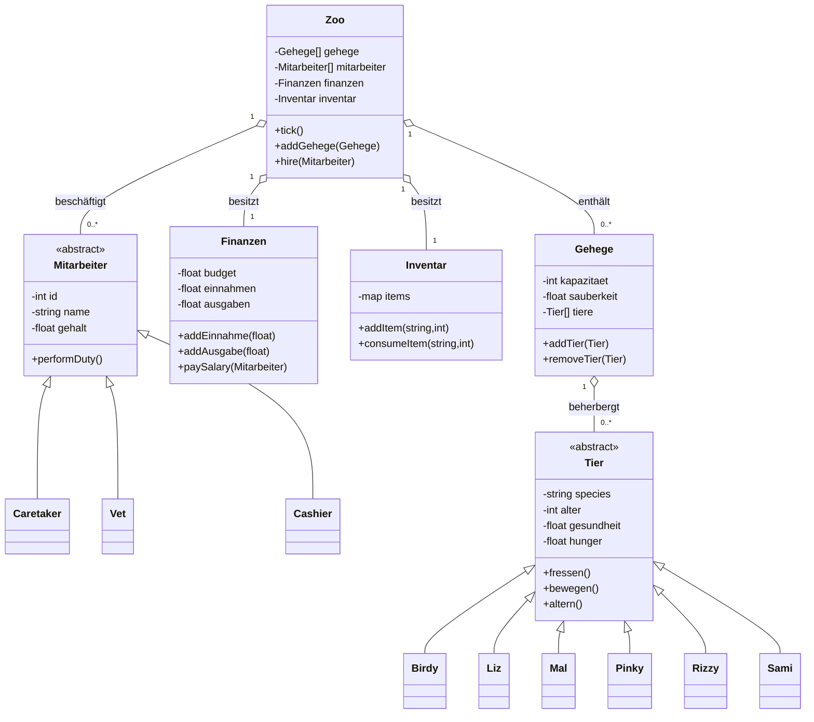

# Design: Zoo-Verwaltung (Mermaid-Diagramme)

Dieses Dokument enthält Diagramme in Mermaid-Syntax zur Dokumentation des OOP-Designs für den Teilbereich "Zoo-Verwaltung".

## Klassendiagramm (Mermaid)



## Sequenzdiagramm (Mermaid): "Besucher kauft Ticket am Eingang"

Dieses Diagramm beschreibt die Interaktion, wenn ein Besucher ankommt, in der Schlange bezahlt (15s) und den Zoo betritt (Besuchszeit 40s).

```mermaid
sequenceDiagram
    participant Visitor
    participant Cashier
    participant Finanzen
    participant SimulationEngine

    Visitor->>Cashier: Ankunft, Anfrage Ticket
    Cashier->>Visitor: Zeigt Preis (z.B. 1$)
    Visitor->>Cashier: Bezahlen (-> 15s)
    activate Cashier
    Cashier->>Finanzen: addEinnahme(1.0)
    Finanzen-->>Cashier: Bestätigung
    Cashier-->>Visitor: Übergibt Ticket; Visitor.status = "InZoo"
    deactivate Cashier
    SimulationEngine->>Visitor: startBesuchsTimer(40s)
    Note over Visitor,SimulationEngine: Visitor erkundet Karte; nach 40s verlässt Visitor Zoo
```

---

Hinweis: Die Diagramme sind als Mermaid-Code gehalten und können z.B. in VS Code (Markdown Preview Mermaid) oder auf mermaid.live gerendert werden.
