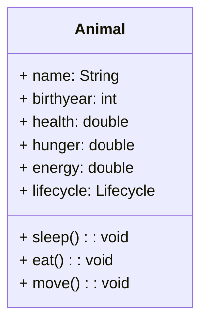

Animal class

```mermaid
classDiagram

class Animal {
    + name: String
    + birthyear: int
    + health: double
    + hunger: double
    + energy: double
    + lifecycle: Lifecycle
    + sleep(): void
    + eat(): void
    + move(): void
}


```