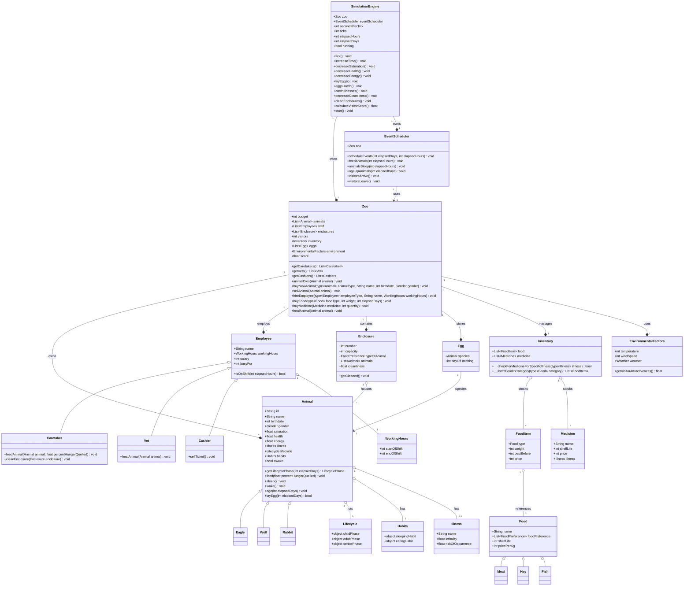

```mermaid
classDiagram
    class Food {
        +String name
        +List~FoodPreference~ foodPreference
        +int shelfLife
        +int pricePerKg
    }
    class Meat
    class Hay
    class Fish
    class FoodItem {
        +Food type
        +int weight
        +int bestBefore
        +int price
    }
    class Inventory {
        +List~FoodItem~ food
        +List~Medicine~ medicine
        +__checkForMedicineForSpecificIllness(type~Illness~ illness) bool
        +__listOfFoodInCategory(type~Food~ category) List~FoodItem~
    }
    class Animal {
        +String id
        +String name
        +int birthdate
        +Gender gender
        +float saturation
        +float health
        +float energy
        +Illness illness
        +Lifecycle lifecycle
        +Habits habits
        +bool awake
        +getLifecyclePhase(int elapsedDays) LifecyclePhase
        +feed(float percentHungerQuelled) void
        +sleep() void
        +wake() void
        +age(int elapsedDays) void
        +layEgg(int elapsedDays) bool
    }
    class Eagle 
    class Wolf 
    class Rabbit 
    class Zoo {
        +int budget
        +List~Animal~ animals
        +List~Employee~ staff
        +List~Enclosure~ enclosures
        +int visitors
        +Inventory inventory
        +List~Egg~ eggs
        +EnvironmentalFactors environment
        +float score
        +getCaretakers() List~Caretaker~
        +getVets() List~Vet~
        +getCashiers() List~Cashier~
        +animalDies(Animal animal) void
        +buyNewAnimal(type~Animal~ animalType, String name, int birthdate, Gender gender) void
        +sellAnimal(Animal animal) void
        +hireEmployee(type~Employee~ employeeType, String name, WorkingHours workingHours) void
        +buyFood(type~Food~ foodType, int weight, int elapsedDays) void
        +buyMedicine(Medicine medicine, int quantity) void
        +healAnimal(Animal animal) void
    }
    class Employee {
        +String name
        +WorkingHours workingHours
        +int salary
        +int busyFor
        +isOnShift(int elapsedHours) bool
    }
    class WorkingHours {
        +int startOfShift
        +int endOfShift
    }
    class Caretaker {
        +feedAnimal(Animal animal, float percentHungerQuelled) void
        +cleanEnclosure(Enclosure enclosure) void
    }
    class Vet {
        +healAnimal(Animal animal) void
    }
    class Cashier {
        +sellTicket() void
    }
    class Enclosure {
        +int number
        +int capacity
        +FoodPreference typeOfAnimal
        +List~Animal~ animals
        +float cleanliness
        +getCleaned() void
    }
    class EnvironmentalFactors {
        +int temperature
        +int windSpeed
        +Weather weather
        +getVisitorAttractiveness() float
    }
    class Egg {
        +Animal species
        +int dayOfHatching
    }
    class Illness {
        +String name
        +float lethality
        +float riskOfOccurrence
    }
    class Medicine {
        +String name
        +int shelfLife
        +int price
        +Illness illness
    }
    class Lifecycle {
        +object childPhase
        +object adultPhase
        +object seniorPhase
    }
    class Habits {
        +object sleepingHabit
        +object eatingHabit
    }
    class SimulationEngine {
        +Zoo zoo
        +EventScheduler eventScheduler
        +int secondsPerTick
        +int ticks
        +int elapsedHours
        +int elapsedDays
        +bool running
        +tick() void
        +increaseTime() void
        +decreaseSaturation() void
        +decreaseHealth() void
        +decreaseEnergy() void
        +layEggs() void
        +eggsHatch() void
        +catchIllnesses() void
        +decreaseCleanliness() void
        +cleanEnclosures() void
        +calculateVisitorScore() float
        +start() void
    }
    class EventScheduler {
        +Zoo zoo
        +scheduleEvents(int elapsedDays, int elapsedHours) void
        +feedAnimals(int elapsedHours) void
        +animalsSleep(int elapsedHours) void
        +ageUpAnimals(int elapsedDays) void
        +visitorsArrive() void
        +visitorsLeave() void
    }

    Food <|-- Meat
    Food <|-- Hay
    Food <|-- Fish
    Animal <|-- Eagle
    Animal <|-- Wolf
    Animal <|-- Rabbit
    Employee <|-- Caretaker
    Employee <|-- Vet
    Employee <|-- Cashier
    Employee "1" o-- "1" WorkingHours : has
    Zoo "1" --* "*" Animal : owns
    Zoo "1" --* "*" Employee : employs
    Zoo "1" --* "*" Enclosure : contains
    Zoo "1" --* "*" Egg : stores
    Zoo "1" --* "1" Inventory : manages
    Zoo "1" --* "1" EnvironmentalFactors : uses
    Enclosure "1" o-- "*" Animal : houses
    Animal "1" o-- "1" Lifecycle : has
    Animal "1" o-- "1" Habits : has
    Animal "1" o-- "0-1" Illness : has
    Inventory "1" o-- "*" FoodItem : stocks
    Inventory "1" o-- "*" Medicine : stocks
    FoodItem "1" o-- "1" Food : references
    Egg "1" --> "1" Animal : species
    SimulationEngine "1" --* "1" Zoo : owns
    SimulationEngine "1" --* "1" EventScheduler : owns
    EventScheduler "1" --> "1" Zoo : uses

```
