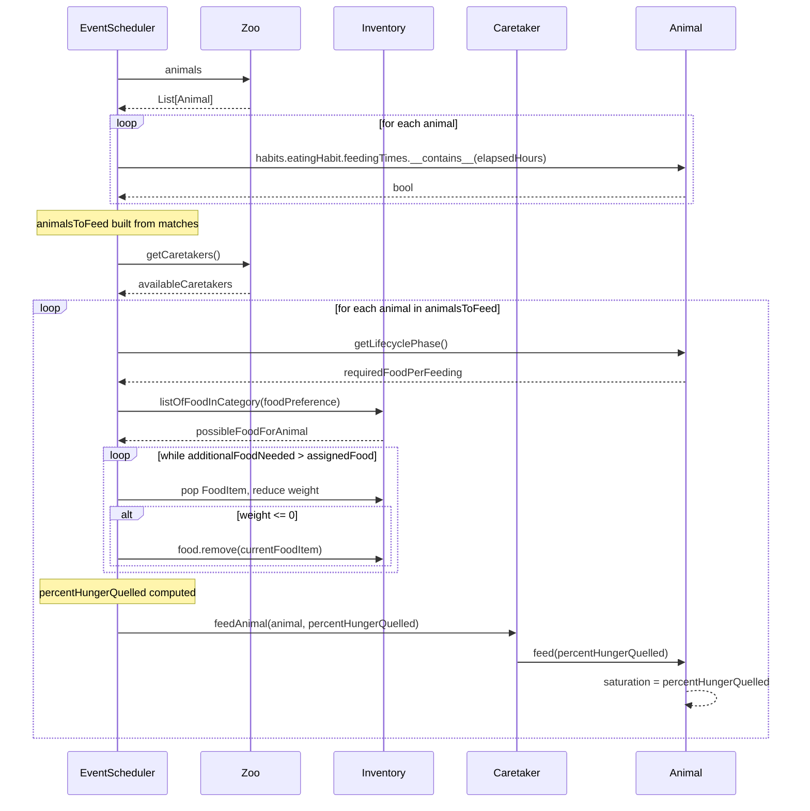

```mermaid
sequenceDiagram
    participant ES as EventScheduler
    participant Z as Zoo
    participant I as Inventory
    participant C as Caretaker
    participant A as Animal

    ES->>Z: animals
    Z-->>ES: List[Animal]

    loop for each animal
        ES->>A: habits.eatingHabit.feedingTimes.__contains__(elapsedHours)
        A-->>ES: bool
    end
    note over ES: animalsToFeed built from matches

    ES->>Z: getCaretakers()
    Z-->>ES: availableCaretakers

    loop for each animal in animalsToFeed
        ES->>A: getLifecyclePhase()
        A-->>ES: requiredFoodPerFeeding

        ES->>I: listOfFoodInCategory(foodPreference)
        I-->>ES: possibleFoodForAnimal

        loop while additionalFoodNeeded > assignedFood
            ES->>I: pop FoodItem, reduce weight
            alt weight <= 0
                ES->>I: food.remove(currentFoodItem)
            end
        end
        note over ES: percentHungerQuelled computed

        ES->>C: feedAnimal(animal, percentHungerQuelled)
        C->>A: feed(percentHungerQuelled)
        A-->>A: saturation = percentHungerQuelled
    end
```
