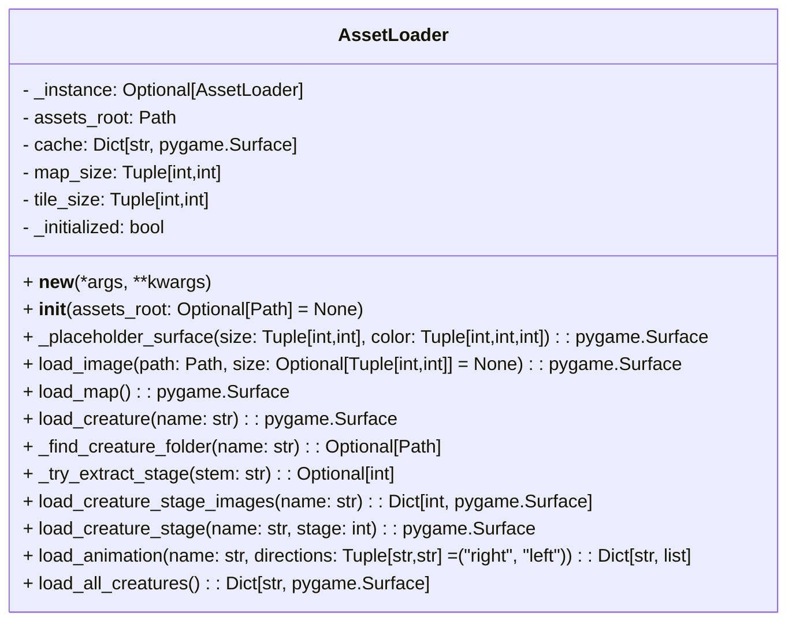

# AssetLoader

- `AssetLoader` is a singleton that loads and caches image assets for the frontend.
- It is responsible for image scaling, fallback placeholders, creature sprite loading, and animation frame retrieval.
