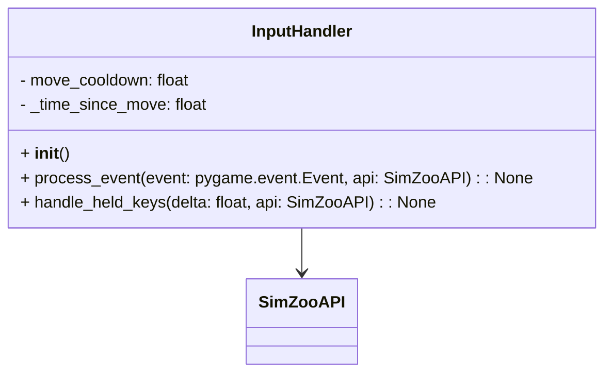

# InputHandler

```mermaid
classDiagram
    class InputHandler {
        - move_cooldown: float
        - _time_since_move: float
        + __init__()
        + process_event(event: pygame.event.Event, api: SimZooAPI) : None
        + handle_held_keys(delta: float, api: SimZooAPI) : None
    }

    InputHandler --> SimZooAPI
```

- `InputHandler` captures keyboard input and sends movement commands to `SimZooAPI`.
- It supports both discrete key events and held-key auto-repeat movement.
