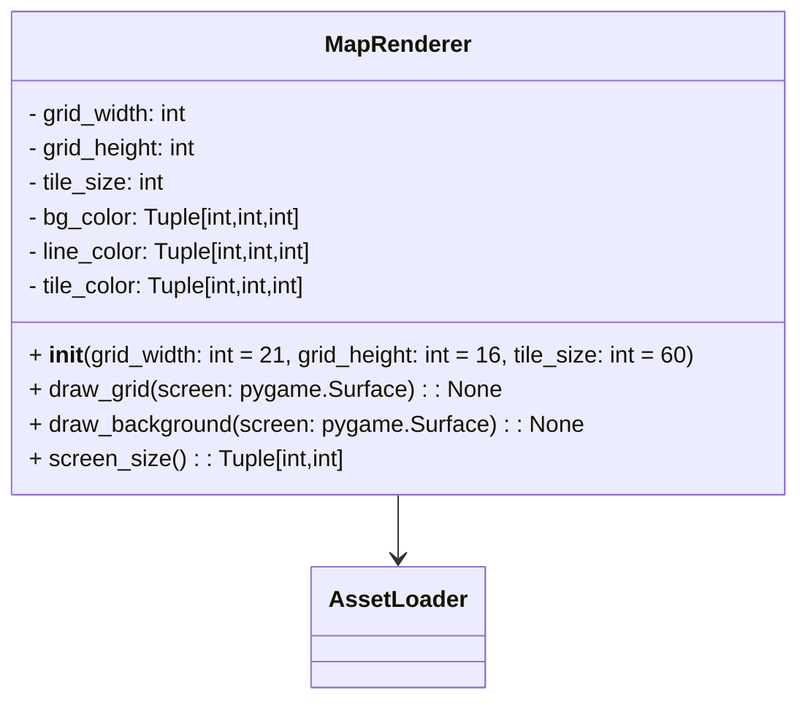

# MapRenderer

- `MapRenderer` renders the grid and optional background map for the game world.
- It delegates background image loading to `AssetLoader` and falls back to procedural rendering if loading fails.
