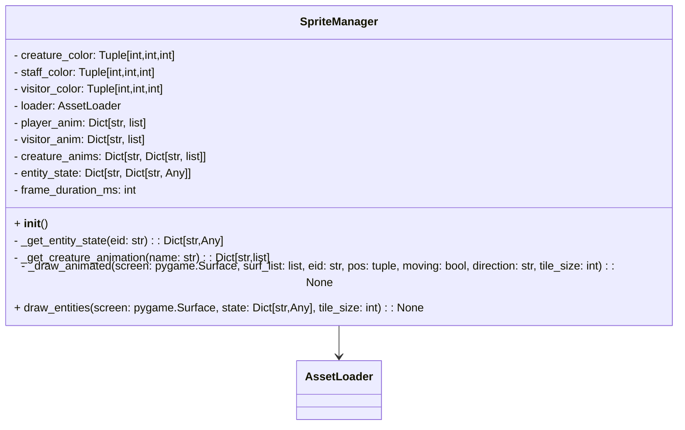

# SpriteManager

- `SpriteManager` draws creatures, staff, visitors, and the player based on the frontend state.
- It uses `AssetLoader` for sprite and animation frame loading, with fallback shapes for missing assets.
