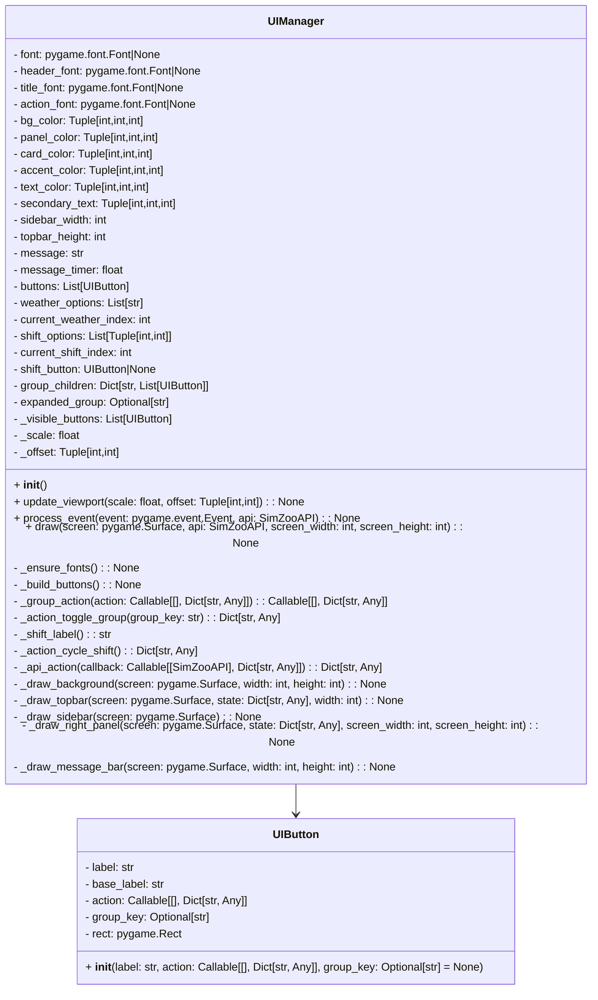

# UIManager and UIButton

- `UIButton` represents a clickable sidebar button with an optional grouped sub-menu.
- `UIManager` builds the dashboard, handles input, and renders the UI panels for the frontend.
